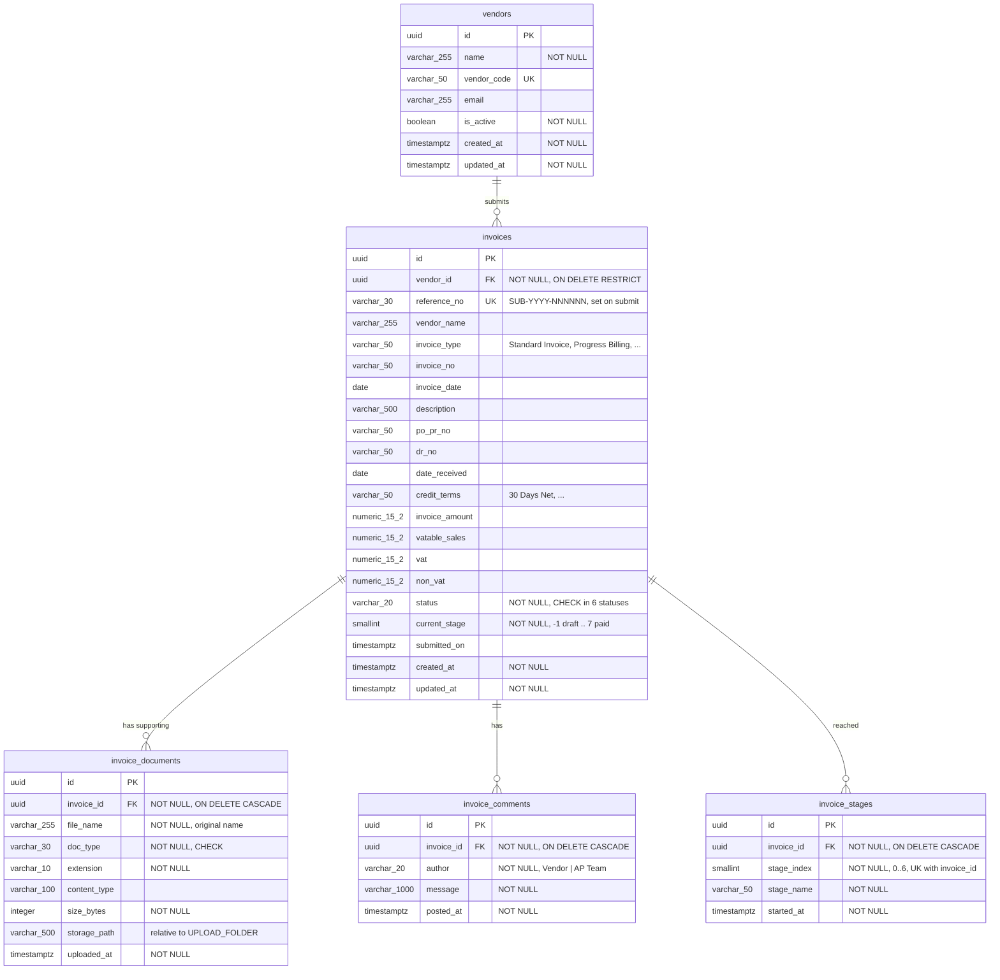

# Database schema

Created by migration `0001_vendor_portal`
([migrations/versions/20260918_0001_create_vendor_portal_tables.py](../migrations/versions/20260918_0001_create_vendor_portal_tables.py)).

## Tables

| Table | Serves (Vue app) | Notes |
| --- | --- | --- |
| `vendors` | Header / "current vendor" | Each invoice belongs to one vendor. Until auth exists the API picks the vendor from the `X-Vendor-Id` header. |
| `invoices` | Submit Invoice form, Invoice Status list, Invoice Overview, Details page | Drafts keep the form fields nullable. The full validation runs on submit. Money is `NUMERIC(15,2)`. |
| `invoice_documents` | Supporting Documents step, Details page document list | Files are stored on disk under `UPLOAD_FOLDER/invoices/<invoice_id>/<random>.<ext>`. The DB keeps the original name and metadata. |
| `invoice_comments` | Comments page | `author` is `Vendor` (posted through the vendor API) or `AP Team` (posted through AP actions). |
| `invoice_stages` | Status Timeline (mini and full) | One row for each stage reached, with its start time. Ordered by `stage_index`, these rows are the UI's `stageTimes[]`. |

## Status and stage model

`invoices.current_stage` indexes the processing stages:

| index | stage | `status` while in progress |
| --- | --- | --- |
| -1 | *(draft)* | Draft |
| 0 | Submitted | – |
| 1 | AP Validation | Submitted |
| 2 | Business Approval | Under Review (or Rejected) |
| 3 | Ariba Processing | Approved |
| 4 | S/4HANA Transfer | Approved |
| 5 | Payment Scheduled | Approved |
| 6 | Paid | Approved |
| 7 | *(completed)* | Paid |

When an invoice is submitted, the API writes stage rows 0 and 1 and sets `current_stage = 1`. Each AP "advance" adds the next stage row. A rejection leaves the invoice at stage 2 with status `Rejected`.

## Indexes and constraints

- `invoices (vendor_id, status)`, `(vendor_id, invoice_date)` and `(vendor_id, invoice_no)` back the Invoice Status filters and the duplicate-invoice check.
- `invoices.reference_no` is unique. `invoice_stages (invoice_id, stage_index)` is unique.
- CHECK constraints limit `status`, `doc_type`, `author`, `current_stage` and `stage_index` to the values the UI knows.
- Documents, comments and stages cascade-delete with their invoice. A vendor can't be deleted while it still has invoices.
